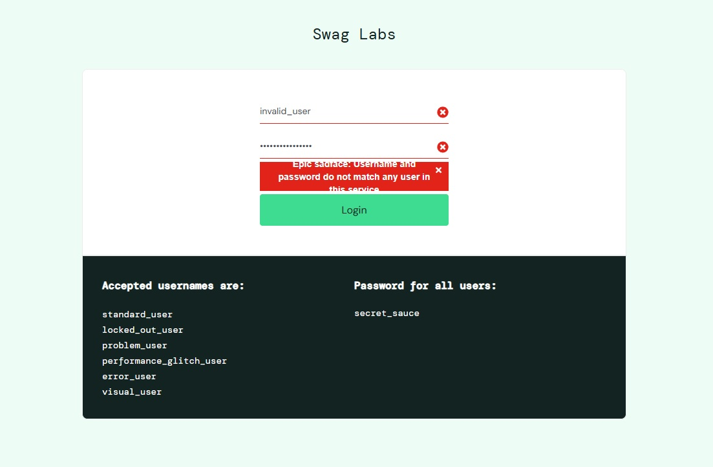

# BUG-001 Login Error Message Visibility

## Description

The login error message has low visual contrast and may be difficult for users to read.

## Severity

Low

## Priority

Low

## Environment

Chrome Browser

## Preconditions

- User is on the login page.

## Steps To Reproduce

1. Open SauceDemo.
2. Enter an invalid username.
3. Enter an invalid password.
4. Click Login.

## Expected Result

The error message should be clearly visible and easy to read.

## Actual Result

The error message has low contrast and is difficult to distinguish from the background.

## Impact

Users may not easily identify the reason for the login failure.

## Status

Open

## Evidence

See evidence/bug001.png
