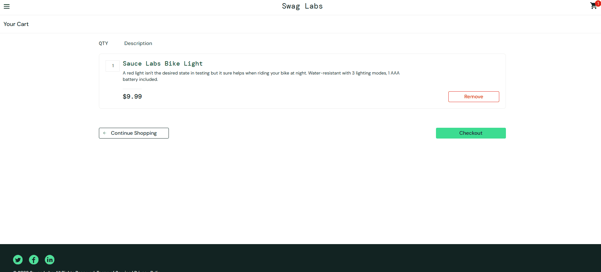

# BUG-002 Checkout Allows Empty Spaces

## Description

The checkout form accepts fields containing only blank spaces.

## Severity

Medium

## Priority

Medium

## Environment

Chrome Browser

## Preconditions

- User is logged in.
- At least one product is in the cart.

## Steps To Reproduce

1. Add a product to the cart.
2. Click Checkout.
3. Enter spaces only in First Name.
4. Enter spaces only in Last Name.
5. Enter spaces only in Postal Code.
6. Click Continue.

## Expected Result

The system should reject blank values and display a validation message.

## Actual Result

The form accepts the values and allows the user to continue.

## Impact

Invalid customer information may be stored in the system.

## Status

Open

## Evidence

